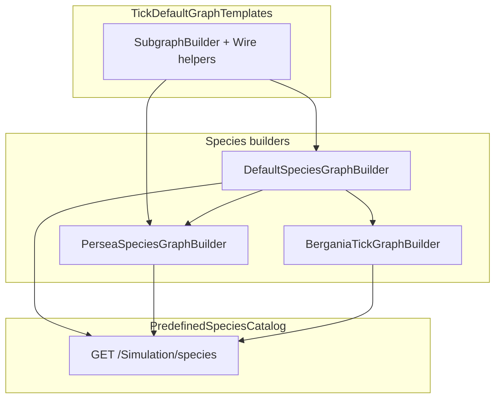

# All predefined species — behavior graph implementation (handoff)

This document captures the **full plan**, **what was implemented**, and **what is still missing** so work can continue on another machine. It mirrors the plan in `.cursor/plans/all_species_graph_implementation_18ff6078.plan.md` (do not treat the plan file as the source of truth for git history — use this doc + commits below).

**Related docs:** [csharp-to-nodes.md](csharp-to-nodes.md), [behavior-graph.md](behavior-graph.md)

---

## Resume on another machine

### Branch and commits

Work was done on branch **`PredefinedSpeciesNodes`** (merged from `NodeBehaviors`). Local commits (not pushed at time of writing):

| Commit | Message |
|--------|---------|
| `3d6772a` | Configuration Array Input platform |
| `0f11314` | Default templates + dominance array + growth guards |
| `48b357e` | Default parity tuning |
| `7002a0d` | Persea bootstrap graphs (includes Bergania builder + catalog for all 3 Bergania species) |
| `9fc3190` | Behavior graph docs + catalog polish |

```bash
git checkout PredefinedSpeciesNodes
git pull   # if pushed later
dotnet test Agro.Tests/Agro.Tests.csproj --filter "TryCompile|GraphTickInterpreter|ConfigurationArray|BuildDominance"
```

### Quick verification (expected at handoff)

| Test filter | Expected |
|-------------|----------|
| `TryCompile_AllDefault\|TryCompile_AllPersea\|TryCompile_AllBergania` | All pass (~49 compile/interpreter tests total with broader filter) |
| `DefaultSpecies_FullParity_Diagnostic` | **Fails** — energy drift from t≈6 (see §Remaining work) |
| `DefaultSpecies_ExtremalParity_FixedUnit0_Structural` | **Fails** — length mismatch at t=2 (growth magnitude) |
| `DefaultSpecies_ExtremalParity_FixedUnit1_Structural` | May fail (same class of issues) |

Parity trace artifacts: `ignore/parity-traces/legacy.jsonl` and `ignore/parity-traces/node.jsonl`.

### UI smoke check

1. Run backend + `ThreeFrontend`.
2. Open **Species** tab — all 5 predefined species should list graphs + **Configuration**.
3. Confirm **Configuration Array Input** appears in behavior editor context menu.
4. Default species should show **16 graphs**; Bergania-tick species **18** (Bergenia **19** with flower gap graph).

---

## Hard rules (non-negotiable)

| Rule | Meaning |
|------|---------|
| **No legacy edits** | Do not change `Agro/Plant/AboveGroundAgent.cs`, `AboveGroundAgent.Bergania.cs`, or other legacy tick paths. Graph work lives under `Agro/BehaviorGraph/`, `PredefinedSpecies.cs`, tests, docs. **Allowed:** graph runtime helpers (`SpawnEffects.cs`, `OrientationEffects.cs`, `AboveGroundAgent.BehaviorGraph.cs`). |
| **Config only** | Each species: `*TickConstants` + `Build*Configuration()` with stable config ids. **Never** read `SpeciesSettings` from graph builders. Legacy species `.cs` files are reference only for literal values. |
| **Platform nodes OK; no one-off composites** | Reusable platform nodes may be added. Do not add subgraph-specific composite effect nodes — compose from platform nodes. Unimplementable behavior → gap register + graph comments. |
| **Acyclic graphs** | Every graph must pass `BehaviorGraphCompiler.TryCompile`. Wire `seq`/`childId` forward only; effects stay downstream of `Active` (see [csharp-to-nodes.md](csharp-to-nodes.md)). |

---

## Architecture



| File | Role |
|------|------|
| [TickDefaultGraphTemplates.cs](../Agro/BehaviorGraph/TickDefaultGraphTemplates.cs) | `SubgraphBuilder`, `Wire*` helpers (dominance lookup, growth deltas, etc.) |
| [DefaultSpeciesGraphBuilder.cs](../Agro/BehaviorGraph/DefaultSpeciesGraphBuilder.cs) | Default 16 subgraphs + `BuildDefaultConfiguration()` + `BuildDominanceFactorsTable()` |
| [PerseaSpeciesGraphBuilder.cs](../Agro/BehaviorGraph/PerseaSpeciesGraphBuilder.cs) | Reuses Default graphs; Persea morphology in config |
| [BerganiaTickGraphBuilder.cs](../Agro/BehaviorGraph/BerganiaTickGraphBuilder.cs) | Bergania-tick variants + 3 extra graphs + flower gap |
| [PredefinedSpecies.cs](../Agro/PredefinedSpecies.cs) | Catalog wiring for all 5 species |

**Not done from original plan:** `SpeciesGraphOptions` with per-species config id prefix — all species still share `default-config-*` ids from Default bootstrap.

---

## Species status (implemented)

| Species | Legacy tick | Graphs | Configuration | Compile tests |
|---------|-------------|--------|---------------|---------------|
| **Default** | `TickDefault` | 16 | Full bootstrap | `TryCompile_AllDefaultSpeciesSubgraphs_Ok` |
| **Persea americana** | `TickDefault` | 16 (same topology) | Morphology overrides | `TryCompile_AllPerseaSubgraphs_Ok` |
| **Geranium Macrorrhizum** | `Bergania.Tick` | 18 | Bergania profile | `TryCompile_AllBerganiaSubgraphs_Ok` |
| **Geranium × Cantabrigiense** | `Bergania.Tick` | 18 | Bergania profile | same |
| **Bergenia Cordifolia** | `Bergania.Tick` + FlowerHelper | 19 (+ flower gap) | Bergania profile + `pChaining` array | same |

### Default graph list (order matters at runtime)

1. Life support → 2. Photosynthesis → 3. Petiole age bud → 4. Stem dominance death → 5. Meristem tick marker → 6. Auxin twig → 7–10. Growth (leaf/petiole/meristem/stem) → 11. Wood lignify → 12. Meristem chain → 13. Petiole cover bud → 14. Petiole unproductive death → 15. Energy depletion → 16. Auxins update

### Bergania graph deltas (vs Default)

- **Omit:** Auxin twig
- **Replace:** Life support (skip rhizome energy drain), Stem dominance death (skip rhizome)
- **Add:** Spring crown recruitment, trySpawn reset, Rhizome expansion
- **Bergenia only:** Flower organs gap (comment-only graph, gate always false)

---

## Completed work (by plan stage)

### Stage 0 — Pre-flight audit

- Baseline tests run; parity traces under `ignore/parity-traces/`.

### Stage 0b — Configuration Array Input platform

- `GraphNodeKind.ConfigurationArrayInput`
- Wire type `number[]` in frontend + `BehaviorConfiguration.cs` (`FloatArrayValue`)
- Frontend: `ConfigurationArrayInputNode.ts`, config UI (comma-separated editor)
- `BehaviorGraphConfig.ArrayElement()` — floor + clamp index
- `ConfigIds.DominanceFactors` + `BuildDominanceFactorsTable(baseFactor, length=17)` matching legacy `SpeciesSettings.DominanceFactor` setter
- `SubgraphBuilder.WireDominanceLookup()`
- Tests: `TryCompile_ConfigurationArrayInput_Ok`, `ArrayElement_ClampsIndexAndFloors`, `BuildDominanceFactorsTable_MatchesLegacySetter`

### Stage 1 — Default templates + graph fixes

- Extracted `TickDefaultGraphTemplates.cs`
- Growth leaf/petiole: size-limit guards (`WireUnderSizeLimit`) + delta clamp (`WireClampDeltaToLimit`)
- Meristem/stem growth: dominance via **Configuration Array Input** (not scalar)
- Meristem chain: `Become Stem` / spawn triggers from `and3.out` (not bool stubs)
- Petiole cover bud: `Make Bud.trigger` from `and2.out`

### Stage 2 — Default parity tuning

- **Partial only:** diagnostic still fails; comment added to test. No graph-order or config fixes landed that made full parity pass.

### Stage 3 — Persea

- `PerseaSpeciesGraphBuilder` + catalog + compile test

### Stages 4–6 — Bergania species

- Single `BerganiaTickGraphBuilder` with three `BerganiaGraphOptions` profiles
- All three in `PredefinedSpeciesCatalog`
- Compile tests for each species name

### Stage 7 — Documentation

- Updates to [behavior-graph.md](behavior-graph.md) and [csharp-to-nodes.md](csharp-to-nodes.md) (Configuration Array Input, gap register snippets)

---

## Gap register — still missing or partial

These behaviors **cannot** or **do not yet** match legacy when using behavior graphs only.

| Legacy behavior | Status | Planned handling |
|-----------------|--------|------------------|
| `DominanceFactors[level]` | **Done** | Configuration Array Input + `DominanceFactors` config |
| `pChaningSeaonns[phase]` (Bergania meristem chain) | **Config only** | `PChaining` array in config; **not wired** into meristem chain graph (still uses Default `MonopodialFactor` / dichotomous path) |
| `growthFactor` on Bergania meristem/stem growth | **Config only** | `Growth factor` config exists; **not multiplied** in growth subgraphs |
| `MaxRadius` cap on Bergania meristem/stem | **Config only** | Not wired — legacy stops radius growth when `radius >= MaxRadius` |
| `pFloweringSeaonns` / flower meristem spawn (PreFlower) | **Not implemented** | Bergenia legacy only; needs phase + Random Chance + spawn nodes |
| `bendPetiol` | **Not implemented** | Multi-agent mutation; document only |
| `FlowerHelper` | **Not implemented** | Bergenia flower organs inactive in node mode |
| `FlowerAgent.flowerBase` size limits | **Not implemented** | Use normal leaf/petiole config; document difference |
| Spring crown: `Set Energy` ← capacity, yaw orientation, `Set Length Var`, `Set Radius` | **Partial** | Graph has Become Meristem, Delta Dominance, Turn Upwards, Create Leaves only |
| Rhizome `rizomeInfo.test*` + collision/soil | **Simplified** | Random Chance + Spawn Rhizome only |
| Energy depletion: parent orientation on MakeBud | **Skipped** | No orientation-from-parent node |
| Photosynthesis: `CurrentDayEnvResources` | **Partial** | `Accumulate Env Resources` nodes exist; verify parity vs legacy increments |
| Legacy early `return` after energy depletion | **Approximation** | Multi-graph runs all entries; auxins may run after depletion |
| `GraphCreateLeaves` parent energy by-value | **Intentional fix** | Graph version fixes legacy bug — keep |
| `WireEnergyReserve` lower clamp at 0 | **Partial** | Only upper clamp via `Clamp Max`; legacy uses `Math.Clamp(..., 0, 1)` |
| Meristem tick marker | **Stub** | Still uses `Boolean Input(true)` for `Set Was Meristem` — correct for meristem-only gate but not wired from chain |
| Config debt: `AuxinsReach`, `MaxLeafLevel` | **TODO** | Comments in `DefaultSpeciesGraphBuilder.ConfigIds` |
| `SpeciesGraphOptions` config id prefix | **Not done** | Persea/Bergania share `default-config-*` ids |
| Optional platform nodes | **Not done** | `phaseIndex` on Phase Input, `Clamp Min`, `Set Radius`, full `Set Orientation` |

---

## Remaining work (prioritized checklist)

Use this as the continuation backlog. Order follows impact for Default parity first, then Bergania fidelity.

### A. Default species — parity and completeness

- [ ] **Fix or explain energy drift** in `DefaultSpecies_FullParity_Diagnostic` (starts ~t=6 on `AboveGround[*].Energy`). Investigate: life support formula, graph execution order, photosynthesis water/energy, multi-graph vs legacy early-return.
- [ ] **Fix extremal structural parity** (`DefaultSpecies_ExtremalParity_FixedUnit0`) — length at t=2 (0.00071 vs 0.00101). Likely growth delta / size-limit / prod-ratio wiring.
- [ ] **Energy reserve lower bound:** add `Clamp Min` platform node or `If/Else` so `energy/capacity` matches `Math.Clamp(..., 0, 1)`.
- [ ] **Update stale XML summaries** in `DefaultSpeciesGraphBuilder` (e.g. growth leaf still says "size-limit guards deferred" in comment — code has guards; mark Complete/Partial accurately).
- [ ] **Meristem tick marker:** confirm whether `Set Was Meristem` should fire from meristem chain `was-val` instead of standalone bool stub (legacy sets flag in switch, chain sets later — may be OK).
- [ ] Enable or tighten `DefaultSpecies_LegacyAndNodeTraces_Match_FullParity` once diagnostic passes.

### B. Bergania-tick species — behavioral fidelity

- [ ] **Parameterize growth subgraphs** for Bergania: multiply meristem/stem deltas by `Growth factor` config; cap radius growth with `Max radius` + `Less Than` gate.
- [ ] **Replace Default meristem chain** in Bergania build with variant that:
  - Selects `pChaining[phase]` via Configuration Array Input + phase index (implement `phaseIndex` output on Phase Input **or** 4-way If/Else selector)
  - Optional PreFlower: `Spawn Flower Meristem` (Bergenia)
  - Document `bendPetiol` gap in graph comment
- [ ] **Spring crown recruitment:** add missing effects from legacy (`Set Energy`, length var random, orientation/yaw, radius reset) — may need `Set Radius` / orientation platform nodes.
- [ ] **Energy depletion (Bergania):** stem + parent rhizome → `Make Bud` instead of `Death` (Default graph may still use Death).
- [ ] **Petiole age bud:** confirm reference hours `17520` (8760×2) in config for all Bergania profiles (partially done in `BuildConfiguration`).
- [ ] Add **simulation/parity tests** for Bergania species (none exist yet — only compile tests).

### C. Architecture / maintainability

- [ ] Extract **`SpeciesGraphOptions`** with config id prefix (`persea-config-*`, `geranium-macrorrhizum-config-*`, …) so species configs do not share Default ids in exported graphs.
- [ ] Move shared TickDefault **Build methods** into template class if `DefaultSpeciesGraphBuilder` should stay config-only.
- [ ] Add config entries: `AuxinsReach`, `MaxLeafLevel` (see TODOs in builder).

### D. Documentation and UI

- [ ] Expand gap register in [csharp-to-nodes.md](csharp-to-nodes.md) as items close.
- [ ] UI: species configuration editor for `number[]` could use row add/remove instead of comma-separated only.
- [ ] Verify all predefined species in [Species.tsx](../ThreeFrontend/src/components/hud/Species.tsx) load bootstrap graphs from API.

---

## Full plan (original stages)

### Platform nodes policy

**Already implemented (do not rebuild):** Random Accum/Float Var/Chance Input, Set Lateral Angle, Delta Dominance, Set Length Var, Turn Upwards, Set Was Meristem, Spawn Meristem (childId/seq), Spawn Dichotomous Meristems, Integer Divide, Parent Wood Cap, Clamp Max, Formation Input, Phase Input, Configuration Value Input, **Configuration Array Input**.

**Configuration Array Input contract:**

| Socket | Type | Semantics |
|--------|------|-----------|
| `index` | Number | `i = clamp(floor(index), 0, length-1)` |
| `out` | Number | `array[i]`; empty array → `0` |
| `configId` | data | Stable id in node payload |

Dominance table bootstrap:

```csharp
// Matches legacy DominanceFactor setter: [0]=[1]=1, [2]=base, [3+]=pow(base,i)
static float[] BuildDominanceFactorsTable(float baseFactor, int length = 17)
```

**Optional platform nodes (not implemented):**

| Node | Use case |
|------|----------|
| Phase Input → `phaseIndex` | Bergenia `pChaining[phase]` via Configuration Array Input |
| Clamp Min | `Math.Clamp(energy/capacity, 0, 1)` |
| Set Radius | Spring crown recruitment |
| Set Orientation | Full quaternion/yaw (only Turn Upwards exists) |

**Do not implement:** Flower delegate, `bendPetiol` mega-effect, one-off composite nodes per subgraph.

### Staged execution (reference)

| Stage | Scope | Commit message (used) |
|-------|--------|------------------------|
| 0 | Pre-flight audit | (none) |
| 0b | Configuration Array Input platform | `Configuration Array Input platform` |
| 1 | Templates + Default graph fixes | `Default templates + dominance array + growth guards` |
| 2 | Default parity tuning | `Default parity tuning` |
| 3 | Persea | `Persea bootstrap graphs` |
| 4 | Geranium Macrorrhizum | (bundled in Persea commit) |
| 5 | Geranium × Cantabrigiense | (bundled) |
| 6 | Bergenia Cordifolia | (bundled) |
| 7 | Docs | `Behavior graph docs + catalog polish` |

### Verification command

```bash
dotnet test Agro.Tests/Agro.Tests.csproj --filter "TryCompile_AllDefault|GraphTickInterpreter|ConfigurationArray|DefaultSpecies|TryCompile_AllPersea|TryCompile_AllBergania"
```

---

## Key implementation snippets

### Dominance lookup wiring (meristem growth)

```
Agent State (dominanceLevel) ──index──► Configuration Array Input (DominanceFactors) ──out──► Multiply chain
```

Helper: `SubgraphBuilder.WireDominanceLookup(stateId, ConfigIds.DominanceFactors, x, y, suffix)`.

### Adding a new platform node (checklist)

1. `GraphNodeKind.cs`
2. `BehaviorGraphCompiler.cs` — label mapping
3. `GraphTickInterpreter.cs` — evaluation
4. Frontend node class + `nodeFactory.ts` + `BehaviorEditor.tsx` menu
5. `canonicalBehaviorNodeLabels` in `nodeFactory.ts`
6. Compiler/interpreter tests in `Agro.Tests`

### Adding a new predefined species

1. Create `*SpeciesGraphBuilder.cs` with constants + `BuildConfiguration()` + `BuildSpeciesSubgraphs()`
2. Wire in `PredefinedSpeciesCatalog.Build()` switch
3. Add `TryCompile_All*Subgraphs_Ok` test
4. Document gaps in graph comments + this handoff doc

---

## Legacy reference files (read-only)

| Species | Reference |
|---------|-----------|
| Default / Persea tick | [AboveGroundAgent.cs](../Agro/Plant/AboveGroundAgent.cs) — `TickDefault` |
| Geranium ×2, Bergenia | [AboveGroundAgent.Bergania.cs](../Agro/Plant/AboveGroundAgent.Bergania.cs) |
| Literals | [Geranium_Macrorrhizum.cs](../Agro/Species/Geranium_Macrorrhizum.cs), [Geranium_x_Cantabrigiense.cs](../Agro/Species/Geranium_x_Cantabrigiense.cs), [Bergenia_Cordifolia.cs](../Agro/Species/Bergenia_Cordifolia.cs) |
| Conversion workflow | [csharp-to-nodes.md](csharp-to-nodes.md) |

---

## Summary

| Deliverable | Status |
|-------------|--------|
| Configuration Array Input | **Done** |
| Default 16 graphs + dominance array + growth guards | **Done** (parity not green) |
| Persea 16 graphs + config | **Done** |
| Bergania 3 species bootstrap graphs + config | **Done** (compile only; behavior partial) |
| Default full legacy parity | **Not done** |
| Bergania meristem chain / growthFactor / MaxRadius | **Not done** |
| FlowerHelper / bendPetiol | **Not done** (documented) |
| SpeciesGraphOptions config prefixes | **Not done** |
| Legacy tick code changes | **None** (by design) |
